Домашнее задание "Сбор и хранение логов с Rsyslog"
-----------------------------------------

#### Описание задания

1. В Vagrant разворачиваем 2 виртуальные машины web и log
2. на web настраиваем nginx
3. на log настраиваем центральный лог сервер на любой системе на выбор
journald;
rsyslog;
elk.
4. настраиваем аудит, следящий за изменением конфигов nginx 
Все критичные логи с web должны собираться и локально и удаленно.
Все логи с nginx должны уходить на удаленный сервер (локально только критичные).
Логи аудита должны также уходить на удаленную систему.

5. Создать третью виртуальную машину, настроить rsyslog на отправку всех логов на центральный сервер логов. 
Пример настройки rsyslog для отправки логов взять из лекционного материала

****Критерии оценивания****

Статус "Принято" ставится при выполнении следующих условий:
1. Ссылка на репозиторий GitHub. 
2. Логи и скриншоты без Vagrantfile

Помимо базового задания рекомендуется сделать данное задание следующим образом:

3. Все настройки сделать с помощью Ansible и добавить запуск Ansible playbook из Vagrantfile.
4. Предоставить Vagrantfile

****Формат сдачи:****
Vagrantfile + ansible

****Используемый стек для стенда:****
- VirtualBox 7.0.12,
- Vagrant 2.4.1,
- Vagrant Box "bento/ubuntu-22.04" (version v202407.23.0)
- Хостовая система: Ubuntu 22.04.4 LTS
- Ansible 2.10.8

***Запуск стенда:***

```
vagrant up
vagrant ssh
```

Описание решения:
----------
1. Результатом запуска [Vagrantfile](Vagrantfile) файла командой ```vagrant up``` станет три вирутальных машины:
 - ```log``` - центральный сервер rsyslog с IP 192.168.57.15;
 - ```web``` с nginx, клиент rsyslog;
 - ```vm3``` отправляет все логи на сервер, клиент rsyslog.
   
     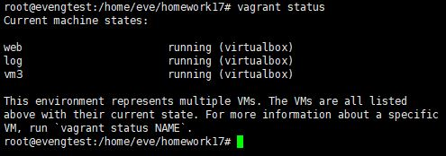
   
2. В секции ```provision "ansible"``` выполняется настройка всей логики выполнения задания с использованием Ansible:
``` 
          config.vm.provision "ansible" do |ansible|
            ansible.compatibility_mode = "2.0"
            ansible.playbook = "ansible/provision.yml"
``` 
Playbook-файл [provision.yml](ansible/provision.yml) содержит следующие задачи и результаты:

* ``` Time configuration``` настройка и синхронизация времени на созданных VM:
``` 
- name: Time configuration
  hosts: all
  become: 'yes'
  
  tasks:
    - name: set timezone
      shell:
        timedatectl set-timezone  Asia/Yekaterinburg

    - name: timesync-status
      shell:
        timedatectl timesync-status
      register: results
    - debug:
       var: results.stdout_lines

    - name: print timedatectl
      shell:
        timedatectl
      register: results
    - debug:
       var: results.stdout_lines

    - name: print date
      shell:
        date
      register: results
    - debug:
       var: results.stdout_lines
 ```

* Лог результата работы playbook'а:
  - настройка и синхронизация времени на созданных VM:
   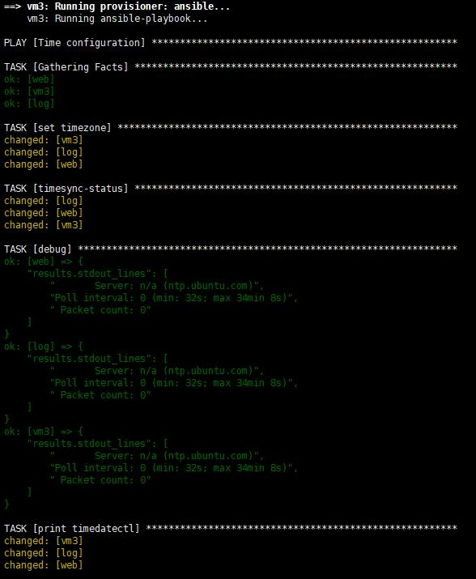
   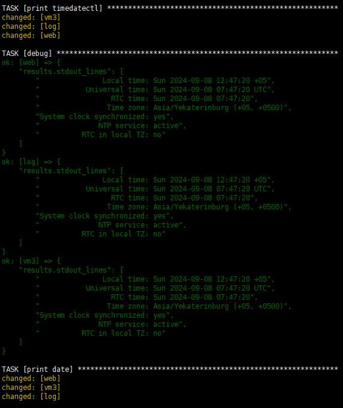
   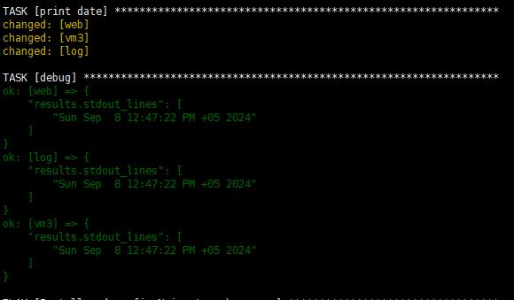


* ```  Install and config Nginx to web server ``` настройка и проверка работы Nginx на web-сервере + настройка отправки логов на центральный сервер Rsyslog:
 ```
 - name: Install and config Nginx to web server
  hosts: web
  become: 'yes'

  handlers:
    - name: restart nginx
      systemd:
        name: nginx
        state: restarted
        enabled: yes
  
  tasks:
    - name: Install nginx
      apt:
        name: nginx
        state: latest
        update_cache: yes
        
    - name: Ensure nginx is running
      systemd:
        name: nginx
        state: started
        enabled: yes
        
    - name: nginx error log configuration
      replace:
        path: /etc/nginx/nginx.conf
        regexp: "{{item.regexp}}"
        replace: "{{item.line}}"
      loop:
        - {regexp: 'access_log /var/log/nginx/access.log;', line: 'access_log  syslog:server=192.168.57.15:514,tag=nginx_access,severity=info combined;'}
        - {regexp: 'error_log /var/log/nginx/error.log;', line: 'error_log   /var/log/nginx/error.log;\n        error_log   syslog:server=192.168.57.15:514,tag=nginx_error;'}
      notify:
        - restart nginx

    - name: check nginx work
      shell:
        ss -tln | grep 80
      register: results
    - debug:
       var: results.stdout_lines

    - name: check nginx curl work
      shell:
        cmd: 'curl http://localhost'
        warn: false
      register: results
    - debug:
       var: results.stdout_lines

 ```
* Лог результата работы playbook'а:
  - настройка Nginx:
   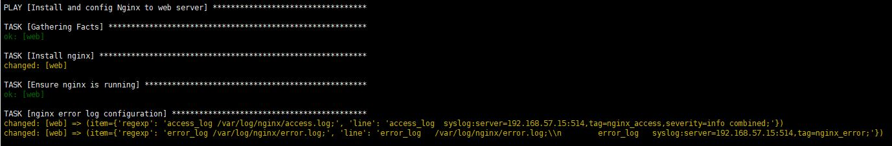

  - проверка, что сервер работает (слушает порт 80 и отдает дефолтную страницу:
   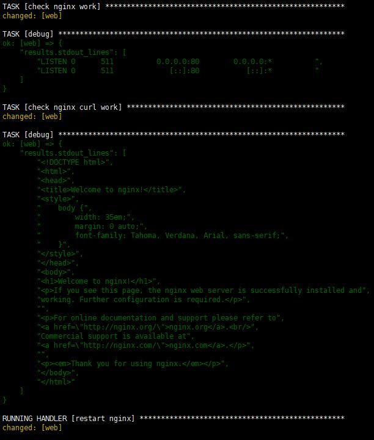

* ```  Install RSyslog to log server ``` настройка и проверка работы RSyslog на центральном log-сервере:
 ```
- name: Install RSyslog to log server
  hosts: log
  become: 'yes'

  tasks:
    - name: Install RSyslog
      apt:
        name: rsyslog
        state: latest
        update_cache: yes
        
    - name: Ensure rsyslog is running
      systemd:
        name: rsyslog
        state: started
        enabled: yes
        
    - name: configuration rsyslog listen
      shell:
        cmd: "{{item}}"
        warn: false
      loop:
        - sed -i 's/^#module(load="imudp")$/module(load="imudp")/' /etc/rsyslog.conf
        - sed -i 's/^#input(type="imudp" port="514")$/input(type="imudp" port="514")/' /etc/rsyslog.conf
        - sed -i 's/^#module(load="imtcp")$/module(load="imtcp")/' /etc/rsyslog.conf
        - sed -i 's/^#input(type="imtcp" port="514")$/input(type="imtcp" port="514")/' /etc/rsyslog.conf

    - name: configuration rsyslog temlate for files
      blockinfile:
        path: /etc/rsyslog.conf
        block: |
          #Add remote logs
          $template RemoteLogs,"var/log/rsyslog/%HOSTNAME%/%PROGRAMNAME%.log"
          *.* ?RemoteLogs
          & ~
        state: present

    - name: restart rsyslog
      systemd:
        name: rsyslog
        state: restarted

    - name: check rsyslog server listen ports
      shell:
        cmd: 'ss -tuln | grep 514'
      register: results
    - debug:
       var: results.stdout_lines

 ```
* Лог результата работы playbook'а:
  - настройка RSyslog:
     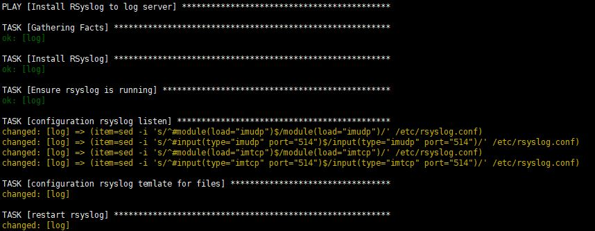

  - проверка работы RSyslog (слушает порт 514):
    
     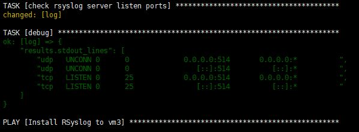

* ```  Install RSyslog to vm3 ``` настройка и проверка работы RSyslog на клиентской машине ```vm3```:
 ```
 - name: Install RSyslog to vm3
  hosts: vm3
  become: 'yes'

  handlers:
    - name: restart rsyslog
      systemd:
        name: rsyslog
        state: restarted
        enabled: yes

  tasks:
    - name: Install RSyslog
      apt:
        name: rsyslog
        state: latest
        update_cache: yes
        
    - name: Ensure rsyslog is running
      systemd:
        name: rsyslog
        state: started
        enabled: yes
        
    - name: configuration rsyslog send
      blockinfile:
        path: /etc/rsyslog.conf
        insertafter: "$WorkDirectory"
        marker: "# Send logs to Server 'log'  "
        block: |
          $PreserveFQDN on
          $ActionQueueFileName queue
          $ActionQueueMaxDiskSpace 1g
          $ActionQueueSaveOnShutdown on
          $ActionQueueType LinkedList
          $ActionResumeRetryCount -1
          *.*    @192.168.56.15:514
        state: present
      notify:
        - restart rsyslog
 ```
* Лог результата работы playbook'а: 
  - настройка RSyslog на клиентской машине:
  - 
     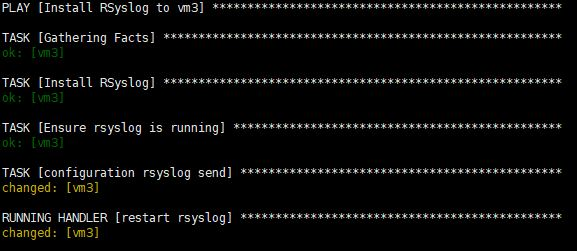

* Итог выполненых тасков:
   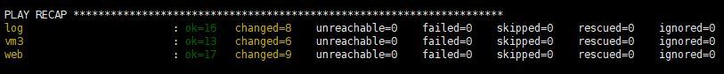


### Результаты: 

Проверяем, что логи на центральный сервер RSyslog приходят и сохраняются согласно настроеному шаблону ```var/log/rsyslog/%HOSTNAME%/%PROGRAMNAME%.log```, т.е. от каждого хоста в свою папку и далее по файлам:

  - проверяем что соответствующие директории создались (создаются при поступлении логов на сервер):
    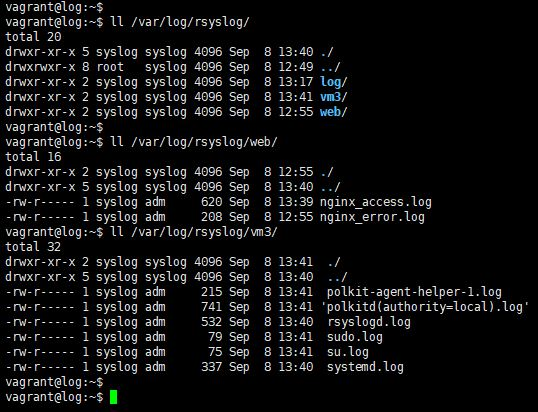

  - проверяем, что логи пишутся (логи ошибок с nginx сервера сгенерированы путем временного переноса конфиг-файла страницы в другую директорию ```mv /var/www/html/index.nginx-debian.html /var/www/```, в результате при открытии страницы получали ошибку ```403 Forbidden```):
    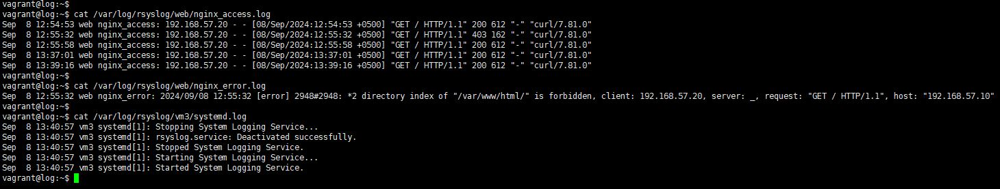

