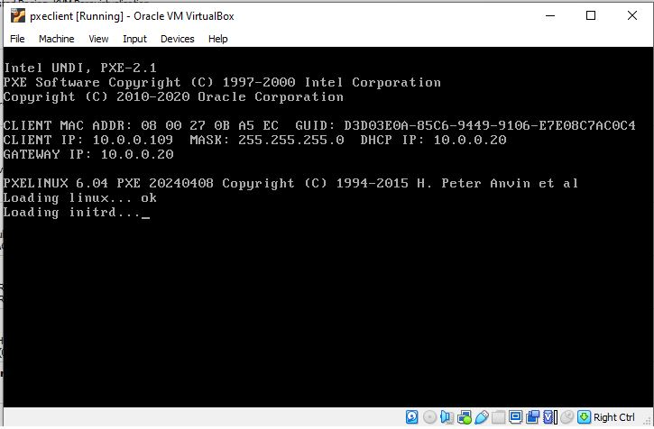
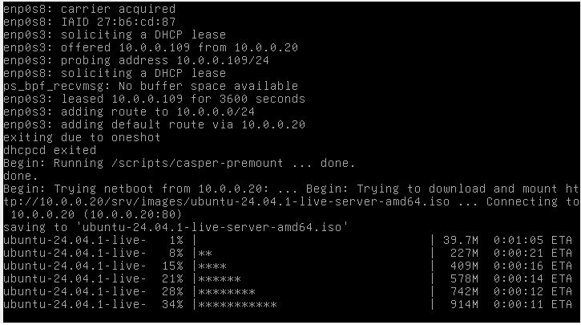
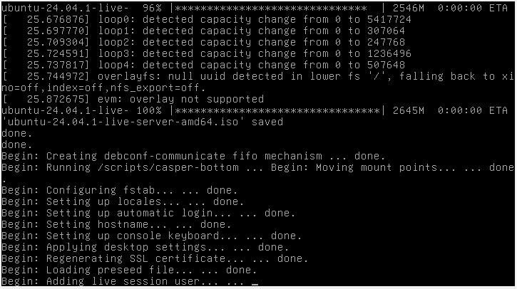
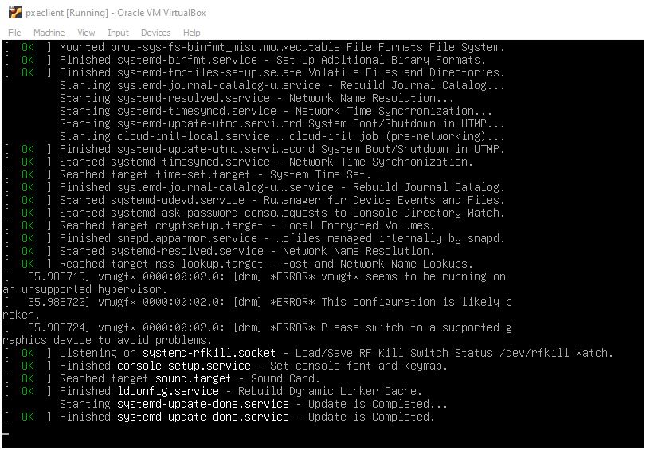
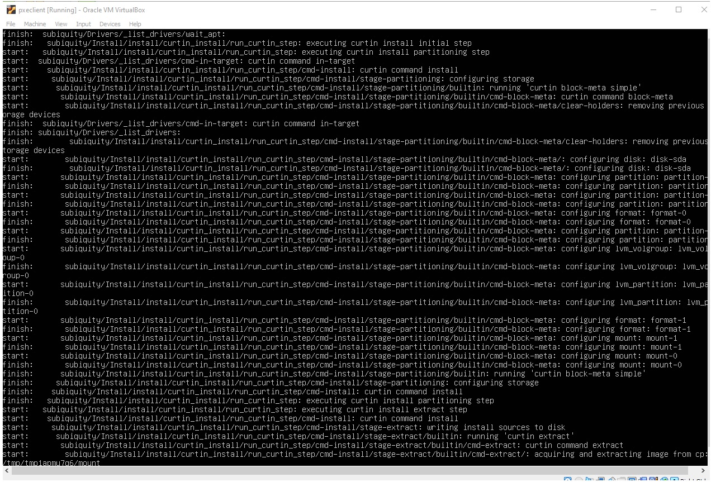
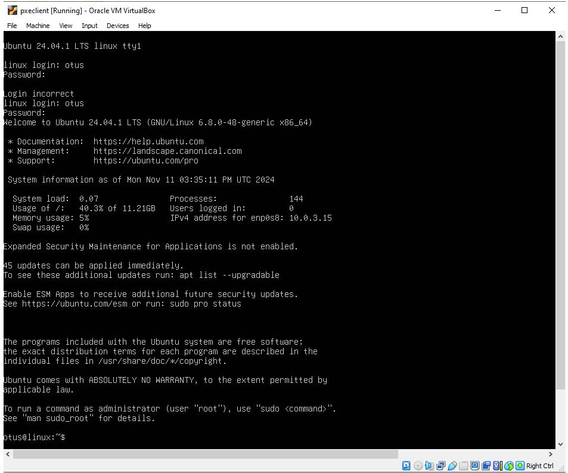

Домашнее задание "Настройка PXE сервера для автоматической установки"
-----------------------------------------

#### Описание задания

1. Настроить загрузку по сети дистрибутива Ubuntu 24
2. Установка должна проходить из HTTP-репозитория.
3. Настроить автоматическую установку c помощью файла user-data
Задания со звёздочкой*
4. Настроить автоматическую загрузку по сети дистрибутива Ubuntu 24 c использованием UEFI
Задания со звёздочкой выполняются по желанию

****Критерии оценивания****

Статус "Принято" ставится при выполнении следующих условий:
1. Ссылка на репозиторий github.
2. Vagrantfile с шагами установки необходимых компонентов
3. Исходный код для настройки сервера (Ansible-playbook)
4. Если какие-то шаги невозможно или сложно автоматизировать, то инструкции по ручным шагам для настройки

****Формат сдачи:****
Vagrantfile + ansible

****Используемый стек для стенда:****
- VirtualBox 7.0.12,
- Vagrant 2.4.1,
- Vagrant Box "bento/ubuntu-22.04" (version v202407.23.0)
- Хостовая система: Ubuntu 22.04.4 LTS
- Ansible 2.10.8

***Запуск стенда:***

```
vagrant up
vagrant ssh
```
**В решении для загрузки ОС по сети используется дистрибутив https://releases.ubuntu.com/noble/ubuntu-24.04.1-live-server-amd64.iso**

Описание решения:
----------
1. Результатом запуска [Vagrantfile](Vagrantfile) файла командой ```vagrant up pxeserver``` будет запущена ВМ ```pxeserver``` (хост к которому будут обращаться клиенты для установки ОС), с настроенными dhcp и web серверами на интерфейсе с IP 10.0.0.20:
2. В секции ```provision "ansible"``` выполняется настройка всей логики выполнения задания с использованием Ansible:
``` 
    server.vm.provision "ansible" do |ansible|
      ansible.compatibility_mode = "2.0"
      ansible.playbook = "ansible/provision.yml"
#      ansible.inventory_path = "ansible/hosts"
#      ansible.host_key_checking = "false"
#      ansible.limit = "all"
    end
``` 
Playbook-файл [provision.yml](ansible/provision.yml) содержит все описания и комментарии выполняемых настроек. 

3. Лог запуска и настройки ВМ ```pxeserver``` с ```ansible.playbook``` после запуска команды ```vagrant up pxeserver``` приведен в файле [ansible_provision_log_output_.log](logs_outputs/ansible_provision_log_output_.log)

4. После запуска ВМ ```pxeserver``` зайдем на нее и проверим, что DHCP и HTTP серверы работают и HTTP сервер отдает страницы с образом загружаемой OS и файлами user-data:
```
root@evengtest:/home/eve/homework20# vagrant ssh pxeserver
Welcome to Ubuntu 22.04.4 LTS (GNU/Linux 5.15.0-116-generic x86_64)

 * Documentation:  https://help.ubuntu.com
 * Management:     https://landscape.canonical.com
 * Support:        https://ubuntu.com/pro

 System information as of Mon Nov 11 08:05:28 PM +05 2024

  System load:  0.79               Processes:             152
  Usage of /:   21.6% of 30.34GB   Users logged in:       0
  Memory usage: 25%                IPv4 address for eth0: 10.0.2.15
  Swap usage:   0%


This system is built by the Bento project by Chef Software
More information can be found at https://github.com/chef/bento

Use of this system is acceptance of the OS vendor EULA and License Agreements.
Last login: Mon Nov 11 20:04:44 2024 from 10.0.2.2
vagrant@pxeserver:~$ 
vagrant@pxeserver:~$ 

vagrant@pxeserver:~$ systemctl status dnsmasq apache2
● dnsmasq.service - dnsmasq - A lightweight DHCP and caching DNS server
     Loaded: loaded (/lib/systemd/system/dnsmasq.service; enabled; vendor preset: enabled)
     Active: active (running) since Mon 2024-11-11 20:04:43 +05; 1h 8min ago
    Process: 4716 ExecStartPre=/etc/init.d/dnsmasq checkconfig (code=exited, status=0/SUCCESS)
    Process: 4724 ExecStart=/etc/init.d/dnsmasq systemd-exec (code=exited, status=0/SUCCESS)
    Process: 4733 ExecStartPost=/etc/init.d/dnsmasq systemd-start-resolvconf (code=exited, status=0/SUCCESS)
   Main PID: 4732 (dnsmasq)
      Tasks: 1 (limit: 1010)
     Memory: 1.2M
        CPU: 523ms
     CGroup: /system.slice/dnsmasq.service
             └─4732 /usr/sbin/dnsmasq -x /run/dnsmasq/dnsmasq.pid -u dnsmasq -7 /etc/dnsmasq.d,.dpkg-dist,.dpkg-old,.dpkg-new --local-service --trust-anchor=.,20326,8,2,e06d44b80b8f1d39a95c0b0d7c65d08458e880409bbc683457104237c7f8ec8d

Nov 11 20:04:43 pxeserver systemd[1]: Starting dnsmasq - A lightweight DHCP and caching DNS server...
Nov 11 20:04:43 pxeserver dnsmasq[4732]: started, version 2.90 cachesize 150
Nov 11 20:04:43 pxeserver dnsmasq[4732]: compile time options: IPv6 GNU-getopt DBus no-UBus i18n IDN2 DHCP DHCPv6 no-Lua TFTP conntrack ipset no-nftset auth cryptohash DNSSEC loop-detect inotify dumpfile
Nov 11 20:04:43 pxeserver dnsmasq-dhcp[4732]: DHCP, IP range 10.0.0.100 -- 10.0.0.120, lease time 1h
Nov 11 20:04:43 pxeserver dnsmasq-dhcp[4732]: DHCP, sockets bound exclusively to interface eth1
Nov 11 20:04:43 pxeserver dnsmasq-tftp[4732]: TFTP root is /srv/tftp/amd64
Nov 11 20:04:43 pxeserver dnsmasq[4732]: reading /etc/resolv.conf
Nov 11 20:04:43 pxeserver dnsmasq[4732]: using nameserver 127.0.0.53#53
Nov 11 20:04:43 pxeserver dnsmasq[4732]: read /etc/hosts - 10 names
Nov 11 20:04:43 pxeserver systemd[1]: Started dnsmasq - A lightweight DHCP and caching DNS server.

● apache2.service - The Apache HTTP Server
     Loaded: loaded (/lib/systemd/system/apache2.service; enabled; vendor preset: enabled)
     Active: active (running) since Mon 2024-11-11 20:04:48 +05; 1h 8min ago
       Docs: https://httpd.apache.org/docs/2.4/
    Process: 4772 ExecStart=/usr/sbin/apachectl start (code=exited, status=0/SUCCESS)
   Main PID: 4776 (apache2)
      Tasks: 55 (limit: 1010)
     Memory: 5.2M
        CPU: 1.369s
     CGroup: /system.slice/apache2.service
             ├─4776 /usr/sbin/apache2 -k start
             ├─4777 /usr/sbin/apache2 -k start
             └─4778 /usr/sbin/apache2 -k start

Nov 11 20:04:48 pxeserver systemd[1]: Starting The Apache HTTP Server...
Nov 11 20:04:48 pxeserver apachectl[4775]: AH00558: apache2: Could not reliably determine the server's fully qualified domain name, using 127.0.2.1. Set the 'ServerName' directive globally to suppress this message
Nov 11 20:04:48 pxeserver systemd[1]: Started The Apache HTTP Server.
vagrant@pxeserver:~$

vagrant@pxeserver:~$ curl http:/10.0.0.20/srv/images/
<!DOCTYPE HTML PUBLIC "-//W3C//DTD HTML 3.2 Final//EN">
<html>
 <head>
  <title>Index of /srv/images</title>
 </head>
 <body>
<h1>Index of /srv/images</h1>
  <table>
   <tr><th valign="top"></th><th><a href="?C=N;O=D">Name</a></th><th><a href="?C=M;O=A">Last modified</a></th><th><a href="?C=S;O=A">Size</a></th><th><a href="?C=D;O=A">Description</a></th></tr>
   <tr><th colspan="5"><hr></th></tr>
<tr><td valign="top"></td><td><a href="/srv/">Parent Directory</a></td><td>&nbsp;</td><td align="right">  - </td><td>&nbsp;</td></tr>
<tr><td valign="top"></td><td><a href="ubuntu-24.04.1-live-server-amd64.iso">ubuntu-24.04.1-live-server-amd64.iso</a></td><td align="right">2024-11-11 20:02  </td><td align="right">2.6G</td><td>&nbsp;</td></tr>
   <tr><th colspan="5"><hr></th></tr>
</table>
<address>Apache/2.4.52 (Ubuntu) Server at 10.0.0.20 Port 80</address>
</body></html>
vagrant@pxeserver:~$ 
vagrant@pxeserver:~$ curl http:/10.0.0.20/srv/ks/
<!DOCTYPE HTML PUBLIC "-//W3C//DTD HTML 3.2 Final//EN">
<html>
 <head>
  <title>Index of /srv/ks</title>
 </head>
 <body>
<h1>Index of /srv/ks</h1>
  <table>
   <tr><th valign="top"></th><th><a href="?C=N;O=D">Name</a></th><th><a href="?C=M;O=A">Last modified</a></th><th><a href="?C=S;O=A">Size</a></th><th><a href="?C=D;O=A">Description</a></th></tr>
   <tr><th colspan="5"><hr></th></tr>
<tr><td valign="top"></td><td><a href="/srv/">Parent Directory</a></td><td>&nbsp;</td><td align="right">  - </td><td>&nbsp;</td></tr>
<tr><td valign="top"></td><td><a href="meta-data">meta-data</a></td><td align="right">2024-11-11 20:04  </td><td align="right">  0 </td><td>&nbsp;</td></tr>
<tr><td valign="top"></td><td><a href="user-data">user-data</a></td><td align="right">2024-11-11 20:04  </td><td align="right">856 </td><td>&nbsp;</td></tr>
   <tr><th colspan="5"><hr></th></tr>
</table>
<address>Apache/2.4.52 (Ubuntu) Server at 10.0.0.20 Port 80</address>
</body></html>
vagrant@pxeserver:~$
```

На текущем этапе PXE сервер для автоматической установки ОС по сети готов.

### Проверка  автоматической загрузки и установки ОС по сети с настроенного PXE сервера: 

Для отслеживания процесса загрузки тестовой ВМ ```pxeclient``` запустил ее в графическом Virtualbox, в параметрах ВМ выбрал загрузку hard и network, чтобы после настройки и перезагрузки ВМ она запустилась с установленной на диск ОС. 
- После запуска ВМ ```pxeclient``` в консоли ВМ видно, что хост получил IP адрес и начал загрузку образа ОС по сети:
   






- После загрузки образа ОС на хост начинается его установка и автоматическая настройка согласно файлу конфигурации [user-data](files/user-data):





- со стороны PXE сервера в логах dnsmasq сервера также виден процесс получения IP адреса запускаемой ВМ ```pxeclient``` по DHCP и процесса отдачи файлов с параметрами автозагруки по TFTP (linux, initrd, pxelinux.cfg/default)

```
root@pxeserver:/home/vagrant# 
root@pxeserver:/home/vagrant# tail -f  /var/log/syslog | grep dnsmasq
Nov 11 15:13:46.652444+00:00 pxeserver dnsmasq-dhcp[747]: DHCPDISCOVER(enp0s8) 08:00:27:0b:a5:ec 
Nov 11 15:13:46.652693+00:00 pxeserver dnsmasq-dhcp[747]: DHCPOFFER(enp0s8) 10.0.0.109 08:00:27:0b:a5:ec 
Nov 11 15:13:46.652723+00:00 pxeserver dnsmasq-dhcp[747]: DHCPDISCOVER(enp0s8) 08:00:27:0b:a5:ec 
Nov 11 15:13:46.652745+00:00 pxeserver dnsmasq-dhcp[747]: DHCPOFFER(enp0s8) 10.0.0.109 08:00:27:0b:a5:ec 
Nov 11 15:13:50.212248+00:00 pxeserver dnsmasq-dhcp[747]: DHCPREQUEST(enp0s8) 10.0.0.109 08:00:27:0b:a5:ec 
Nov 11 15:13:50.212318+00:00 pxeserver dnsmasq-dhcp[747]: DHCPACK(enp0s8) 10.0.0.109 08:00:27:0b:a5:ec 
Nov 11 15:13:50.217051+00:00 pxeserver dnsmasq-tftp[747]: error 0 TFTP Aborted received from 10.0.0.109
Nov 11 15:13:50.217243+00:00 pxeserver dnsmasq-tftp[747]: sent /srv/tftp/amd64/pxelinux.0 to 10.0.0.109
Nov 11 15:13:50.221935+00:00 pxeserver dnsmasq-tftp[747]: sent /srv/tftp/amd64/pxelinux.0 to 10.0.0.109
Nov 11 15:13:50.235954+00:00 pxeserver dnsmasq-tftp[747]: sent /srv/tftp/amd64/ldlinux.c32 to 10.0.0.109
Nov 11 15:13:50.238891+00:00 pxeserver dnsmasq-tftp[747]: file /srv/tftp/amd64/pxelinux.cfg/d3d03e0a-85c6-9449-9106-e7e08c7ac0c4 not found for 10.0.0.109
Nov 11 15:13:50.238968+00:00 pxeserver dnsmasq-tftp[747]: file /srv/tftp/amd64/pxelinux.cfg/01-08-00-27-0b-a5-ec not found for 10.0.0.109
Nov 11 15:13:50.239220+00:00 pxeserver dnsmasq-tftp[747]: file /srv/tftp/amd64/pxelinux.cfg/0A00006D not found for 10.0.0.109
Nov 11 15:13:50.239938+00:00 pxeserver dnsmasq-tftp[747]: file /srv/tftp/amd64/pxelinux.cfg/0A00006 not found for 10.0.0.109
Nov 11 15:13:50.240434+00:00 pxeserver dnsmasq-tftp[747]: file /srv/tftp/amd64/pxelinux.cfg/0A0000 not found for 10.0.0.109
Nov 11 15:13:50.240560+00:00 pxeserver dnsmasq-tftp[747]: file /srv/tftp/amd64/pxelinux.cfg/0A000 not found for 10.0.0.109
Nov 11 15:13:50.240987+00:00 pxeserver dnsmasq-tftp[747]: file /srv/tftp/amd64/pxelinux.cfg/0A00 not found for 10.0.0.109
Nov 11 15:13:50.241876+00:00 pxeserver dnsmasq-tftp[747]: file /srv/tftp/amd64/pxelinux.cfg/0A0 not found for 10.0.0.109
Nov 11 15:13:50.242479+00:00 pxeserver dnsmasq-tftp[747]: file /srv/tftp/amd64/pxelinux.cfg/0A not found for 10.0.0.109
Nov 11 15:13:50.242905+00:00 pxeserver dnsmasq-tftp[747]: file /srv/tftp/amd64/pxelinux.cfg/0 not found for 10.0.0.109
Nov 11 15:13:50.243308+00:00 pxeserver dnsmasq-tftp[747]: sent /srv/tftp/amd64/pxelinux.cfg/default to 10.0.0.109
Nov 11 15:13:51.275003+00:00 pxeserver dnsmasq-tftp[747]: sent /srv/tftp/amd64/linux to 10.0.0.109
Nov 11 15:13:56.743024+00:00 pxeserver dnsmasq-tftp[747]: sent /srv/tftp/amd64/initrd to 10.0.0.109
Nov 11 15:14:01.204181+00:00 pxeserver dnsmasq-dhcp[747]: DHCPDISCOVER(enp0s8) 08:00:27:0b:a5:ec 
Nov 11 15:14:01.204444+00:00 pxeserver dnsmasq-dhcp[747]: DHCPOFFER(enp0s8) 10.0.0.109 08:00:27:0b:a5:ec 
Nov 11 15:14:01.205327+00:00 pxeserver dnsmasq-dhcp[747]: DHCPREQUEST(enp0s8) 10.0.0.109 08:00:27:0b:a5:ec 
Nov 11 15:14:01.205686+00:00 pxeserver dnsmasq-dhcp[747]: DHCPACK(enp0s8) 10.0.0.109 08:00:27:0b:a5:ec 
Nov 11 15:14:45.398914+00:00 pxeserver dnsmasq-dhcp[747]: DHCPDISCOVER(enp0s8) 10.0.0.109 08:00:27:0b:a5:ec 
Nov 11 15:14:45.405440+00:00 pxeserver dnsmasq-dhcp[747]: DHCPOFFER(enp0s8) 10.0.0.108 08:00:27:0b:a5:ec 
Nov 11 15:14:45.407090+00:00 pxeserver dnsmasq-dhcp[747]: DHCPREQUEST(enp0s8) 10.0.0.108 08:00:27:0b:a5:ec 
Nov 11 15:14:45.410444+00:00 pxeserver dnsmasq-dhcp[747]: DHCPACK(enp0s8) 10.0.0.108 08:00:27:0b:a5:ec ubuntu-server
Nov 11 15:14:50.810084+00:00 pxeserver dnsmasq-dhcp[747]: DHCPREQUEST(enp0s8) 10.0.0.109 08:00:27:0b:a5:ec 
Nov 11 15:14:50.811865+00:00 pxeserver dnsmasq-dhcp[747]: DHCPNAK(enp0s8) 10.0.0.109 08:00:27:0b:a5:ec wrong address
Nov 11 15:14:50.818523+00:00 pxeserver dnsmasq-dhcp[747]: DHCPDISCOVER(enp0s8) 10.0.0.109 08:00:27:0b:a5:ec 
Nov 11 15:14:50.820036+00:00 pxeserver dnsmasq-dhcp[747]: DHCPOFFER(enp0s8) 10.0.0.108 08:00:27:0b:a5:ec 
Nov 11 15:14:50.821229+00:00 pxeserver dnsmasq-dhcp[747]: DHCPREQUEST(enp0s8) 10.0.0.108 08:00:27:0b:a5:ec 
Nov 11 15:14:50.821284+00:00 pxeserver dnsmasq-dhcp[747]: DHCPACK(enp0s8) 10.0.0.108 08:00:27:0b:a5:ec ubuntu-server
Nov 11 15:15:10.167022+00:00 pxeserver dnsmasq-dhcp[747]: DHCPDISCOVER(enp0s8) 08:00:27:0b:a5:ec no address available
root@pxeserver:/home/vagrant#
```
- В результате после установки, настройки и загрузки ВМ заходим на нее с использованием логина и пароля otus/123, указанным в [user-data](files/user-data)



**Т.е. автоматическая загрузка и настройка по сети выполнена успешно!**
